# FixIt Frontend — Comprehensive Documentation

> **FixIt** is a digital study desk that transforms NCERT textbooks into an interactive learning experience with flashcards, conceptual quizzes, AI Q&A, and personalized notes — all in one calm, focused space.

---

## Table of Contents

1. [Project Overview](#1-project-overview)  
2. [Tech Stack & Dependencies](#2-tech-stack--dependencies)  
3. [Directory Structure](#3-directory-structure)  
4. [Application Architecture](#4-application-architecture)  
5. [User Flow & Navigation](#5-user-flow--navigation)  
6. [Screen-by-Screen Breakdown](#6-screen-by-screen-breakdown)  
7. [Component Architecture](#7-component-architecture)  
8. [State Management](#8-state-management)  
9. [Data Flow](#9-data-flow)  
10. [API Integration](#10-api-integration)  
11. [Theming System](#11-theming-system)  
12. [Design System & Styling](#12-design-system--styling)  

---

## 1. Project Overview

FixIt is a **React + Vite** single-page application that serves as an interactive study desk for Indian school students. It digitizes NCERT textbooks and provides:

- **Bookshelf Library** — grade-and-board filtered textbook browsing  
- **Interactive Reader** — side-by-side textbook scans + enriched summaries  
- **Study Tools** — keyword-triggered definitions, flashcards, and MCQ quizzes  
- **FSRS Integration** — spaced repetition tracking via backend API  
- **AI Q&A Shell** — contextual "Ask FixIt" panel (streaming container for Week 3 AI)  
- **Dark/Light Theming** — animated View Transition API theme switching  

The frontend runs as a module inside the **FixIt Turborepo** monorepo (`apps/web`), alongside the backend API (`apps/api`) and shared packages.

---

## 2. Tech Stack & Dependencies

| Category | Technology | Version |
|---|---|---|
| **Framework** | React | ^19.2.7 |
| **Build Tool** | Vite | ^8.1.1 |
| **Styling** | TailwindCSS v4 + Vanilla CSS | ^4.3.2 |
| **Authentication** | Clerk (`@clerk/clerk-react`) | ^5.61.8 |
| **Icons** | Phosphor Icons (`@phosphor-icons/react`) | ^2.1.10 |
| **Animation** | Framer Motion | ^12.42.2 |
| **HTTP Client** | Axios | ^1.18.1 |
| **Confetti** | canvas-confetti | ^1.9.4 |
| **Supplementary Icons** | Lucide React | ^1.23.0 |

### Build Configuration

Vite is configured with:
- `@vitejs/plugin-react` — React Fast Refresh & JSX transform  
- `@tailwindcss/vite` — TailwindCSS v4 native Vite plugin  
- **Dev proxy** — `/api` and `/health` routes are proxied to `http://localhost:3001` (the backend API server)

---

## 3. Directory Structure

```
apps/web/
├── public/                       # Static assets (images, screenshots)
├── src/
│   ├── main.jsx                  # App entry point (Clerk wrapper)
│   ├── App.jsx                   # Root component (screen router)
│   ├── App.css                   # Component-specific styles
│   ├── index.css                 # Global design system (21KB+)
│   │
│   ├── components/               # UI Components
│   │   ├── Login.jsx             # Authentication screen
│   │   ├── Onboarding.jsx        # Student profile setup
│   │   ├── Library.jsx           # Bookshelf / book selection
│   │   ├── Reader.jsx            # Core reading workspace (783 lines)
│   │   ├── CentralStudyCard.jsx  # Flashcard + MCQ modal overlay
│   │   ├── ChapterNav.jsx        # Chapter dropdown navigator
│   │   ├── ContextualPanel.jsx   # "Ask FixIt" AI side panel
│   │   ├── SmoothInput.jsx       # Animated caret input component
│   │   ├── ThemeToggle.jsx       # Light/dark theme switcher
│   │   └── theme/
│   │       └── themeAnimations.js # View Transition API animation presets
│   │
│   ├── context/                  # React Context Providers
│   │   ├── LearningContext.jsx   # Core app state (auth, books, study)
│   │   └── ThemeContext.jsx      # Theme state (dark/light)
│   │
│   ├── hooks/                    # Custom React Hooks
│   │   └── useChapters.js        # Chapter data fetching w/ fallback
│   │
│   ├── services/                 # API Service Layer
│   │   └── api.js                # Axios client + endpoint functions
│   │
│   ├── data/                     # Static Data
│   │   └── textbooks.js          # Full textbook content (46KB)
│   │
│   └── assets/                   # Bundled assets (images, fonts)
│
├── index.html                    # HTML entry point
├── vite.config.js                # Vite configuration
├── package.json                  # Dependencies & scripts
└── .env                          # Environment variables
```

---

## 4. Application Architecture

### 4.1 High-Level Architecture Diagram

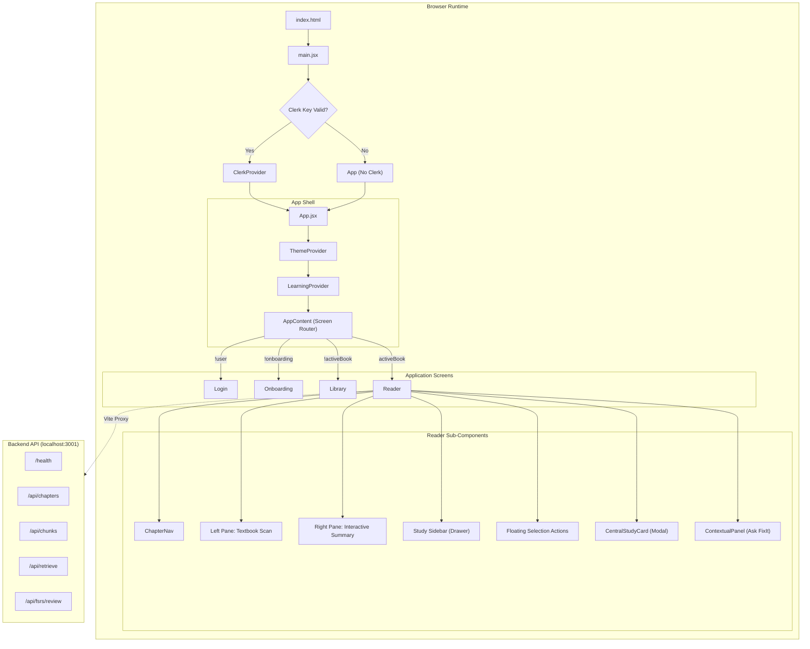

### 4.2 Component Hierarchy Tree

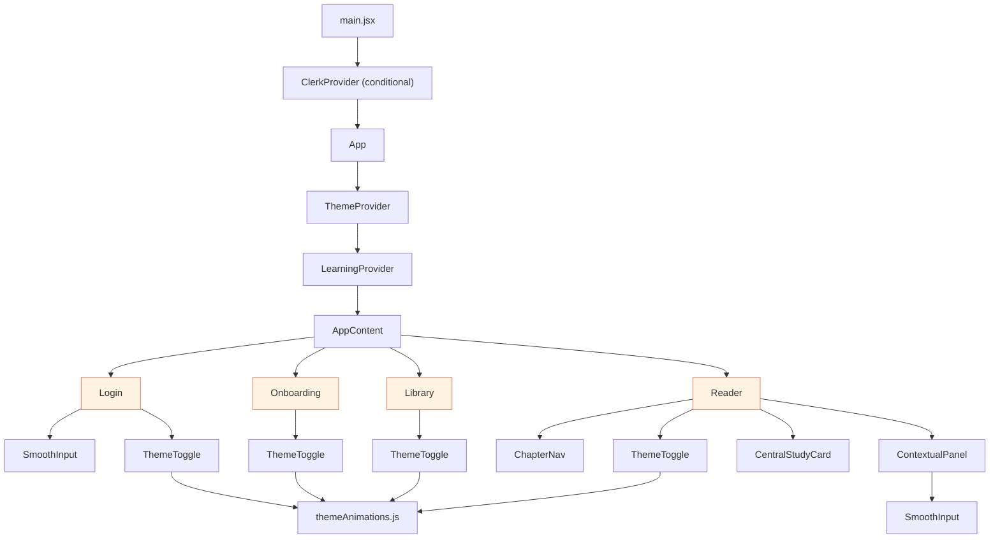

---

## 5. User Flow & Navigation

### 5.1 Complete User Journey Flowchart

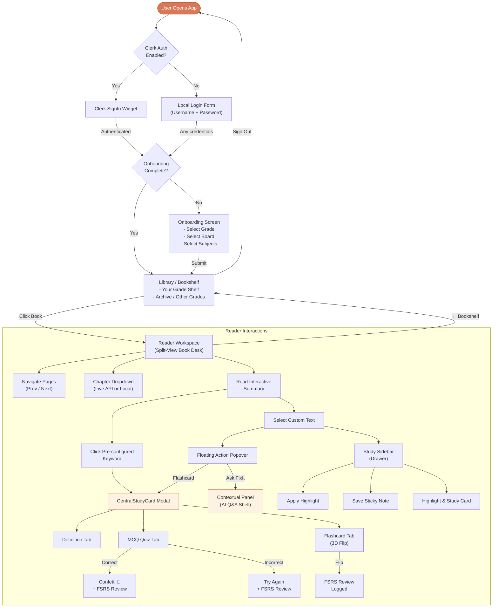

### 5.2 Screen Routing Logic

The application uses a **state-driven router** (no React Router). The `AppContent` component determines the current screen by evaluating a cascade of conditions from `LearningContext`:

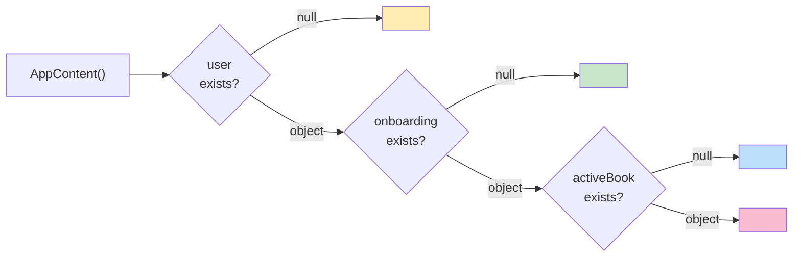

---

## 6. Screen-by-Screen Breakdown

### 6.1 Login Screen

**File:** `src/components/Login.jsx` (198 lines)

The login screen presents a split-layout:
- **Left panel (Desktop):** Dark gradient hero with brand name, tagline, and illustration
- **Right panel:** Authentication form on a warm "desk wood" background

**Dual Auth Modes:**
| Mode | Trigger | Behavior |
|---|---|---|
| **Clerk Mode** | Valid `VITE_CLERK_PUBLISHABLE_KEY` in `.env` | Renders Clerk's `<SignIn />` widget with themed appearance |
| **Local Fallback** | Missing or placeholder Clerk key | Manual username/password form (accepts any credentials) |


---

### 6.2 Onboarding / Student Info Screen

**File:** `src/components/Onboarding.jsx` (196 lines)

A single-card form that collects the student's preferences to personalize their bookshelf:

| Section | Options | UI Pattern |
|---|---|---|
| **Academic Grade** | Class 10, 11, 12 | 3-column pill buttons |
| **Educational Board** | CBSE (NCERT), ICSE, State | Icon cards with sub-labels |
| **Study Subjects** | Computer Science, Biology | Toggle cards with checkmarks |

The selected configuration is persisted to `localStorage` (`ncert_onboarding`) and determines which books appear on the "Your shelf" section of the Library.


---

### 6.3 Library / Bookshelf Screen

**File:** `src/components/Library.jsx` (165 lines)

Displays digitized textbooks as **3D book covers** with gold-leaf styling, organized into two shelves:

1. **"Your [Grade] shelf"** — books matching the student's selected grade
2. **"Archive · other grades"** — remaining textbooks from the catalog

Each book cover features:
- Gradient background color from book metadata
- 3D spine shadow effect
- Simulated white page edges
- Gold border frame and foil typography

The header nameplate shows the user avatar, username, board, and grade info along with sign-out.


---

### 6.4 Reader / Book Workspace Screen

**File:** `src/components/Reader.jsx` (783 lines — the largest component)

The core workspace is a **split-view book desk** comprising:

| Zone | Description |
|---|---|
| **Top Bar** | ← Bookshelf button, ChapterNav dropdown, book title, page counter, theme toggle |
| **Left Pane** | Scanned textbook page image (or fallback rendered HTML) |
| **Spiral Gutter** | Decorative notebook spiral binding separator |
| **Right Pane** | Interactive summary with clickable keywords + text selection |
| **Bottom Bar** | Prev / Next page navigation with page counter |


#### 6.4.1 Chapter Navigation

The **ChapterNav** dropdown (`ChapterNav.jsx`, 118 lines) shows chapters sourced from either:
- **Live API** (`/api/chapters`) — labeled "live"
- **Local fallback** (derived from textbook pages) — labeled "local"

A badge in the dropdown header indicates the data source.


#### 6.4.2 Text Selection & Floating Actions

When a user selects text in the **right summary pane**, a floating popover appears at the selection with two actions:

| Button | Action |
|---|---|
| **Ask FixIt** | Opens the ContextualPanel (AI Q&A side panel) |
| **+ Flashcard** | Highlights text + opens CentralStudyCard in flashcard mode |

Additionally, a bottom toolbar appears with icons for quick actions (highlight, copy, note, sticky, more).


#### 6.4.3 Study Sidebar (Left Drawer)

A slide-out drawer on the left edge provides:
- **Active Selection** section — shows the currently selected text with definition and a sticky note input
- **Saved Highlights** section — list of all user-highlighted passages with notes
- Each highlight card has a "Study →" button and a delete action


---

### 6.5 CentralStudyCard (Modal Overlay)

**File:** `src/components/CentralStudyCard.jsx` (335 lines)

A full-screen modal overlay with three tabbed sections:

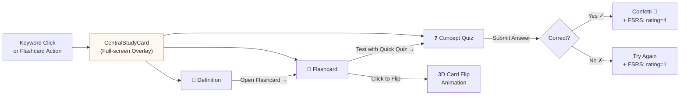

| Tab | Content | Interaction |
|---|---|---|
| **Definition** | Term name, academic definition | "Open Flashcard →" CTA |
| **Flashcard** | 3D flip card (front: question, back: answer) | Click to flip; logs FSRS review on tab change |
| **Concept Quiz** | MCQ with 4 options | Submit → correct/incorrect feedback + confetti |


---

### 6.6 Contextual Panel (Ask FixIt)

**File:** `src/components/ContextualPanel.jsx` (245 lines)

A **right-side slide-out panel** that serves as the AI Q&A conversation container:

- Shows the selected passage as context
- Provides **suggestion chips**: "Explain this in simple terms", "Why does this matter?", "Give me an example"
- Contains a chat-style conversation thread with user bubbles and assistant response slots
- Currently renders **placeholder skeleton** responses (Week 3 will wire live AI streaming)
- Includes a composer input at the bottom with a send button
- "Or turn this selection into a flashcard" secondary action


---

## 7. Component Architecture

### 7.1 Component Responsibility Matrix

| Component | Lines | Primary Responsibility | Key Dependencies |
|---|---|---|---|
| `Reader.jsx` | 783 | Core reading workspace, text selection, page navigation, state orchestration | `LearningContext`, `useChapters`, `CentralStudyCard`, `ChapterNav`, `ContextualPanel` |
| `CentralStudyCard.jsx` | 335 | Study card modal (Definition / Flashcard / Quiz tabs) | `LearningContext`, `canvas-confetti`, `api.reviewFlashcard` |
| `ContextualPanel.jsx` | 245 | AI Q&A conversation shell | `SmoothInput` |
| `SmoothInput.jsx` | 261 | Animated caret text input with spring physics | `framer-motion` |
| `Login.jsx` | 198 | Dual-mode authentication screen | `LearningContext`, `SmoothInput`, `Clerk` |
| `Onboarding.jsx` | 196 | Student profile setup wizard | `LearningContext`, `Phosphor Icons` |
| `Library.jsx` | 165 | Textbook bookshelf browser | `LearningContext`, `textbooks.js` |
| `ChapterNav.jsx` | 118 | Chapter dropdown navigator | - |
| `ThemeToggle.jsx` | 81 | Animated theme switcher button | `ThemeContext`, `themeAnimations.js`, `framer-motion` |

### 7.2 Component Interaction Flow (Reader)

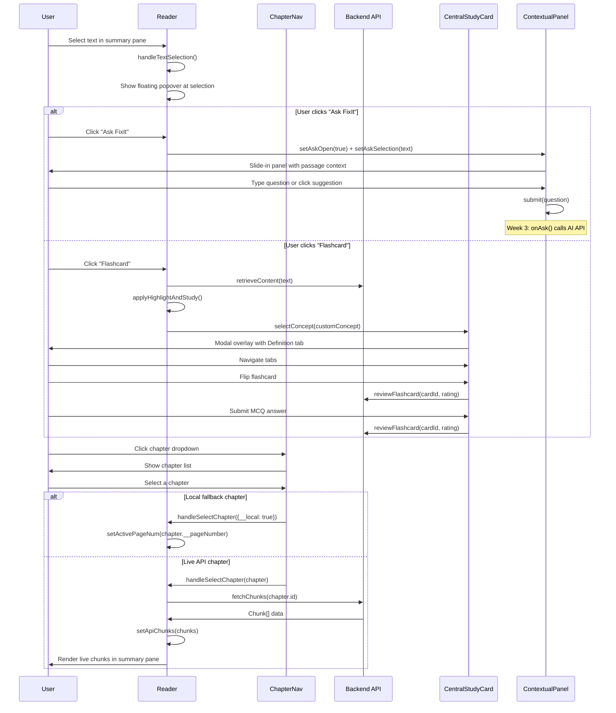

---

## 8. State Management

### 8.1 Context Architecture

FixIt uses **two React Context providers** stacked at the app root:

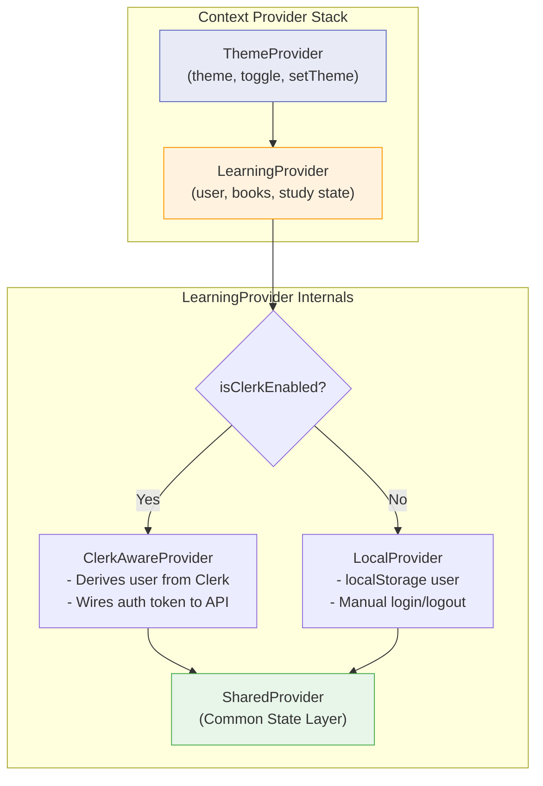

### 8.2 LearningContext State Map

| State Variable | Type | Persistence | Description |
|---|---|---|---|
| `user` | `{ username, loggedIn, clerkId? }` | `localStorage` (local mode) / Clerk session | Current authenticated user |
| `onboarding` | `{ grade, board, subjects }` | `localStorage` (`ncert_onboarding`) | Student's grade/board/subject preferences |
| `activeBook` | `Object` | None (session only) | Currently opened textbook from `textbooks.js` |
| `activePageNum` | `number` | None | Current page number within the active book |
| `activeConceptKey` | `string` | None | Key of the active pre-defined concept (or `"custom"`) |
| `activeCustomConcept` | `Object` | None | Dynamically generated concept from user highlight |
| `sidePanelOpen` | `boolean` | None | Whether the CentralStudyCard modal is visible |
| `activeTab` | `string` | None | Active tab in CentralStudyCard (`definition` / `flashcard` / `mcq`) |
| `completedMCQs` | `Object` | `localStorage` (`ncert_mcq_progress`) | Map of `{bookId}-{conceptKey}` → `true` for completed quizzes |
| `isClerkMode` | `boolean` | N/A (derived) | Whether Clerk authentication is active |

### 8.3 ThemeContext State Map

| State Variable | Type | Persistence | Description |
|---|---|---|---|
| `theme` | `"light" \| "dark"` | `localStorage` (`fixit_theme`) | Active color theme |
| `resolvedTheme` | `string` | N/A (derived) | Same as `theme` (alias) |

### 8.4 Reader Component Local State

The Reader manages significant local state beyond context:

| State | Type | Purpose |
|---|---|---|
| `selPos` | `{ x, y }` | Viewport coordinates for floating selection popover |
| `selectionText` | `string` | Currently selected text in the summary pane |
| `sidebarOpen` | `boolean` | Left study sidebar drawer visibility |
| `noteInput` | `string` | Text area content for sticky notes |
| `userHighlights` | `string[]` | Highlighted text passages (persisted per book) |
| `userNotes` | `Object` | Notes keyed by highlight text (persisted per book) |
| `isFlipping` | `"next" \| "prev" \| null` | Page flip animation state |
| `mobileTab` | `"book" \| "summary"` | Mobile viewport tab toggle |
| `askOpen` | `boolean` | ContextualPanel visibility |
| `askSelection` | `string` | Text passed to ContextualPanel |
| `selectedChapterId` | `string` | Live chapter selection from API |
| `apiChunks` | `Chunk[]` | Content chunks from `/api/chunks` |

---

## 9. Data Flow

### 9.1 Textbook Data Flow

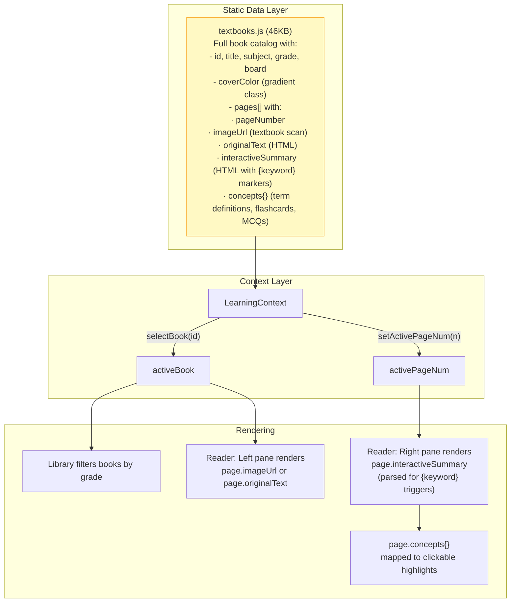

### 9.2 Study Card Data Flow

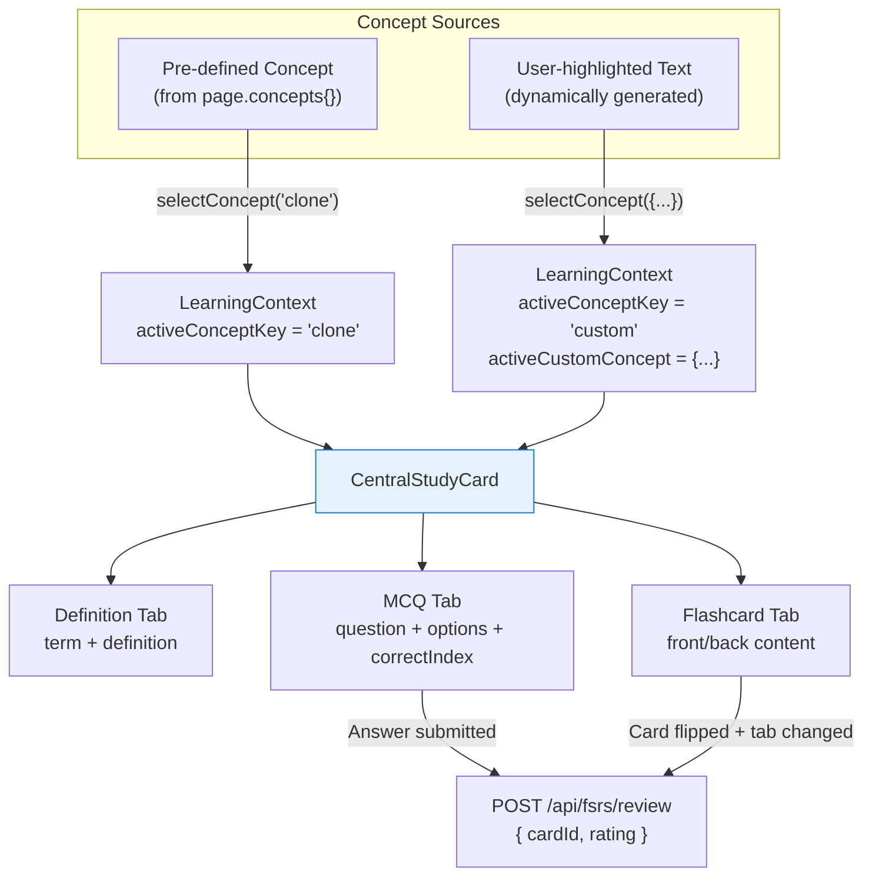

### 9.3 Authentication Data Flow

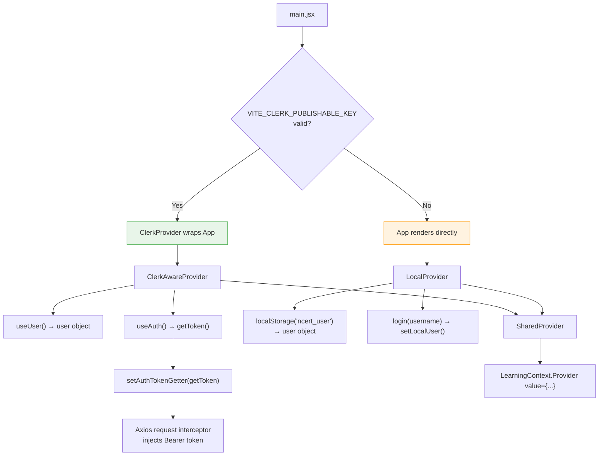

---

## 10. API Integration

### 10.1 API Service Layer

**File:** `src/services/api.js` (106 lines)

An Axios instance configured with:
- **Base URL:** `VITE_API_URL` env variable or `http://localhost:3001`
- **Timeout:** 10 seconds
- **Auth interceptor:** Automatically injects Clerk Bearer token (when available)
- **Vite proxy:** In development, `/api` and `/health` requests are proxied to the backend

### 10.2 API Endpoints

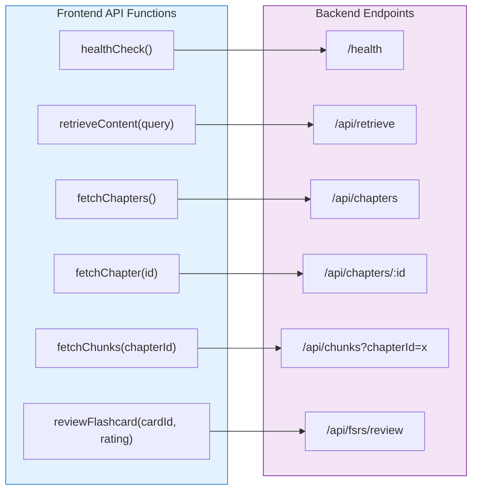

| Function | Method | Endpoint | Used By | Purpose |
|---|---|---|---|---|
| `healthCheck()` | GET | `/health` | — | Verify backend connectivity |
| `retrieveContent(query)` | POST | `/api/retrieve` | Reader (text selection) | Search content chunks by query text |
| `fetchChapters()` | GET | `/api/chapters` | `useChapters` hook | List all chapters (ordered by number) |
| `fetchChapter(id)` | GET | `/api/chapters/:id` | — | Get single chapter with chunks |
| `fetchChunks(chapterId)` | GET | `/api/chunks` | Reader (chapter select) | Get all chunks for a chapter |
| `reviewFlashcard(cardId, rating)` | POST | `/api/fsrs/review` | CentralStudyCard | Submit FSRS spaced repetition review |

### 10.3 useChapters Hook

**File:** `src/hooks/useChapters.js` (68 lines)

A resilient data-fetching hook that:

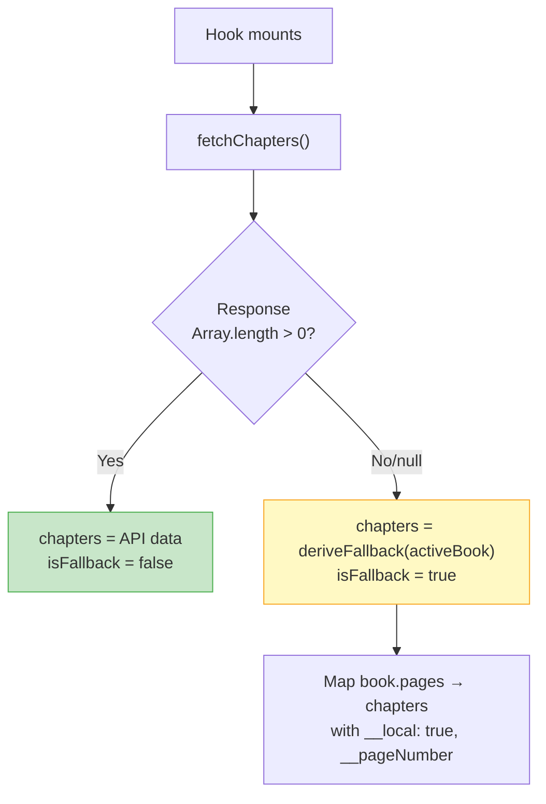

**Return value:** `{ chapters, loading, error, isFallback, reload }`

---

## 11. Theming System

### 11.1 Theme Architecture

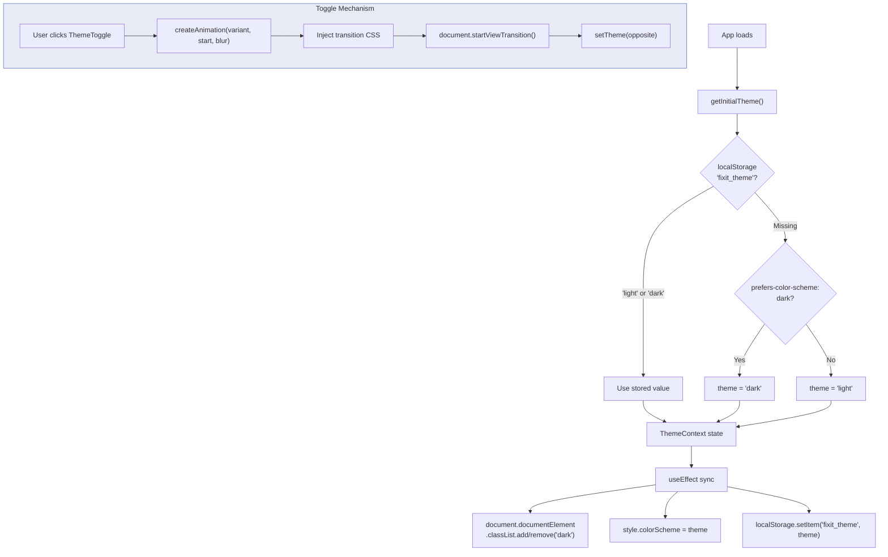

### 11.2 View Transition Animations

The `ThemeToggle` component supports multiple transition variants via `themeAnimations.js`:
- `circle` — circular clip-path expansion from the toggle button
- `rectangle` — rectangular wipe transition
- `polygon` — polygon morph transition
- `circle-blur` — circle with blur effect
- `gif` — animated image overlay transition

The CSS is dynamically injected into a `<style>` tag using the View Transitions API (`document.startViewTransition()`).

### 11.3 CSS Custom Properties (Dark Mode)

The dark theme is applied via `.dark` class on `<html>`, with all custom properties scoped under `:root.dark` in `index.css`. Key overrides include:
- Background surfaces → deep dark tones
- Text colors → light/white variants
- Component borders → darker dividers
- Book desk wood texture → chalkboard-style dark surface

---

## 12. Design System & Styling

### 12.1 CSS Architecture

The styling uses a hybrid approach:
- **TailwindCSS v4** — utility-first classes for layout, spacing, typography
- **Vanilla CSS** (`index.css`, 21KB+) — custom design tokens, animations, and component styles

### 12.2 Design Tokens

| Token | Light Value | Purpose |
|---|---|---|
| `--clay` | `#D97757` | Primary brand color (warm terracotta) |
| `--clay-dark` | `#BD5D3A` | Darker brand accent |
| `--clay-tint` | `#FEF3E2` | Light brand background tint |
| `--ink-soft` | `#78716C` | Secondary text color |
| `--desk-wood` | Warm beige gradient | Page background texture |
| `--chalkboard-green` | `#2D6A4F` | Accent for correct answers / caret |

### 12.3 Key CSS Components

| Class | Description |
|---|---|
| `.desk-wood` | Warm wood-texture background for all major page surfaces |
| `.grain-overlay` | Film grain texture overlay for depth |
| `.leather-mat` | Card container with leather-like shadow and border styling |
| `.bookshelf-wood` | Wooden shelf background for book display |
| `.book-cover` | 3D book cover with hover tilt animation |
| `.book-spine-effect` | Left-edge shadow simulating a book spine |
| `.book-pages-strip` | Right-edge white strip simulating book pages |
| `.index-card` | Lined paper card style for the summary pane |
| `.spiral-ring` | Notebook spiral binding decoration |
| `.flip-card` / `.flip-card-inner` | 3D CSS flip card animation container |
| `.tactile-btn` / `.tactile-btn-primary` | Button styles with press-down transform |
| `.tactile-input` | Input field with warm border and focus ring |
| `.highlight-trigger` | Clickable keyword styling with underline effect |
| `.printed-page` | Page styling mimicking printed paper |

### 12.4 Animation Library

| Animation Class | Effect | Used In |
|---|---|---|
| `animate-fade-up` | Fade in + slide up from below | Login, Onboarding, Library |
| `animate-fade-in` | Simple opacity fade in | Error messages, hints |
| `animate-slide-in-right-page` | Slide in from right | Library entry |
| `animate-slide-out-right` | Slide out to right | Onboarding exit |
| `animate-card-in` | Scale + fade entrance | CentralStudyCard modal |
| `animate-tab-in` | Content fade for tab switches | Study card tab content |
| `animate-pop-in` | Pop scale animation | Floating selection popover |
| `animate-scale-in` | Scale up from origin | ChapterNav dropdown |
| `animate-float` | Gentle floating motion | Mobile brand icon |
| `animate-flip-left` / `animate-flip-right` | Page flip rotation | Reader page navigation |

### 12.5 Typography

| Usage | Font Stack |
|---|---|
| **Headings** (`.font-heading`) | System serif / editorial font |
| **Body** (`.font-body`) | System sans-serif / Inter-style font |

### 12.6 Responsive Strategy

| Breakpoint | Behavior |
|---|---|
| **Mobile** (`< md`) | Single-column layout with tab switcher (Book / Summary Desk) |
| **Tablet** (`md`) | Split-view reader appears, sidebar hidden by default |
| **Desktop** (`lg+`) | Full split layout with hero panel on Login, spiral gutter visible |

---

> **Note:** This documentation reflects the Week 2 state of the FixIt frontend. Week 3 will introduce live AI streaming into the ContextualPanel and may add additional API integrations.
